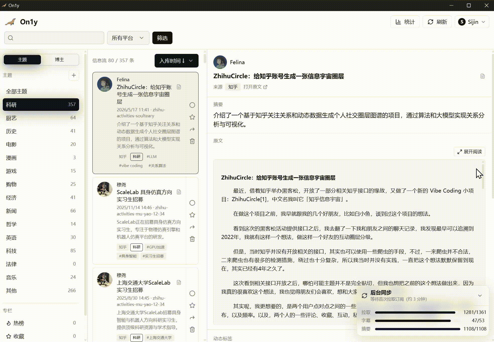

# On1y

**在这个信息无比爆炸的时代，我们不得不往返于各大社交媒体和流媒体平台去获取信息，这让我们受制于平台的推荐算法，不仅耗费了大量的时间在噪声之中，也让我们在信息的高密度冲击下失去寻找目标的能力。**

**本项目，想以返璞归真的方式，收集并整理我们真正需要的信息，并建立起一所代表我们的输入的信息库，同时我们的愿景是他不仅成为一个私人的，独立的，被动的信息聚合平台，而是在我们每个人都可以在这个平台上，基于自己所收集到的信息而输出我们的内容并分享给他人。**

[License: MIT](LICENSE)
[Release](https://github.com/S1jinCheng/ON1Y/releases/latest)
[Python](https://www.python.org/)
[Platform](https://github.com/S1jinCheng/ON1Y/releases/latest)
[Tauri](https://tauri.app/)

[English](README.md) | **简体中文**

[下载安装包](https://github.com/S1jinCheng/ON1Y/releases/latest) · [快速开始](#安装与启动) · [演示](#演示)


---

## 描述

- 数据在本地，不上传云端
- 支持多账号、备份迁移
- 提供 Windows 桌面安装版，开箱即用

### 能做什么


|        |                                      |
| ------ | ------------------------------------ |
| **采集** | B 站关注动态 · YouTube 频道 · 知乎关注；收藏夹与稍后观看 |
| **提取** | 视频字幕 · 知乎正文 · 文章正文                   |
| **蒸馏** | LLM 摘要、要点、自动标签（可选）                   |
| **检索** | 本地 FTS 全文搜索，标题 / 正文 / 摘要             |
| **整理** | 按创作者、标签浏览；笔记、收藏、相关推荐                 |
| **扩展** | 知乎热榜、《经济学人》周刊、Kindle 推送              |
| **迁移** | 导出 `.on1y.zip`，换机可恢复                 |


---

## 演示

On1y 是**本地优先**应用，没有公网在线 Demo，数据与 Cookie 都在你的电脑上。



*安装 → 导入 Cookie → 同步订阅 → 浏览、搜索与 AI 摘要*

---

## 技术栈


| 层级      | 技术                                                                                 |
| ------- | ---------------------------------------------------------------------------------- |
| **桌面壳** | [Tauri 2](https://tauri.app/) · WebView2                                           |
| **前端**  | [Next.js 14](https://nextjs.org/) · React 18 · TypeScript · Tailwind CSS · Zustand |
| **后端**  | [FastAPI](https://fastapi.tiangolo.com/) · Uvicorn · Pydantic                      |
| **存储**  | SQLite · FTS5 全文索引                                                                 |
| **采集**  | B 站 API · RSS / feedparser · yt-dlp                                                |
| **提取**  | Playwright（知乎等）· Jina Reader · BeautifulSoup                                       |
| **AI**  | 可配置 OpenAI 兼容 API（摘要 / 标签）                                                         |
| **打包**  | PyInstaller · NSIS 安装程序                                                            |


---

## 安装与启动

### 用户：Windows 安装包（推荐）

1. 从 [GitHub Releases](https://github.com/S1jinCheng/ON1Y/releases/latest) 下载 `On1y_*-setup.exe`
2. 双击安装，从开始菜单打开 **On1y**
3. 注册 / 登录 → 在设置页导入 Cookie（B 站扫码或 Cookie-Editor 粘贴）
4. 需要 YouTube 时在设置 → 网络中配置代理
5. 设置页选择订阅平台与起始日期，执行首次同步

系统要求：Windows 10/11 x64 · [WebView2](https://developer.microsoft.com/microsoft-edge/webview2/)

### 开发者：从源码运行

```powershell
conda create -n on1y python=3.11 -y
conda activate on1y
git clone https://github.com/S1jinCheng/ON1Y.git
cd ON1Y
pip install -e ".[dev]"
copy .env.example .env
on1y init
on1y serve
```

前端更新：

```powershell
cd frontend
npm install
npm run dev
```

### 常用命令


| 命令                                           | 说明           |
| -------------------------------------------- | ------------ |
| `on1y serve`                                 | 启动后端与工作台     |
| `on1y subscriptions --platform all --ingest` | 同步订阅并入库      |
| `on1y cookies status`                        | 检查 Cookie 状态 |
| `on1y search -q "关键词"`                       | 全文搜索         |
| `pytest -q`                                  | 运行测试         |


---

## 如何贡献

欢迎 Issue 与 Pull Request。

1. **Fork** 本仓库，创建分支 `feat/your-feature`
2. 开发环境见上方「从源码运行」；改动后运行 `ruff check on1y tests` 与 `pytest -q`
3. 提交 PR 时请简要说明改动动机与测试方式
4. 不要提交 `.env`、`data/`、Cookie 等敏感文件

## License

[MIT](LICENSE) · 仓库 [github.com/S1jinCheng/ON1Y](https://github.com/S1jinCheng/ON1Y)