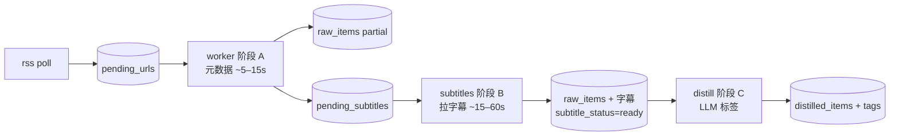

# 视频平台解耦流水线（YouTube / Bilibili：RSS → 快入库 → 字幕 → LLM）

所有 **yt-dlp 视频**（YouTube、B 站）共用三阶段；知乎等文章仍走单段 worker。

## 支持的平台

| 平台 | 阶段 A 快入库 | 阶段 B 字幕 | 需要 Cookie |
|------|----------------|-------------|-------------|
| **YouTube** | ✅ | ✅ | 可选（推荐） |
| **Bilibili** | ✅ | ✅ | **推荐**（字幕常需登录） |
| 知乎 / 小红书 / X | — | — | 各自 Playwright |

## 三阶段



| 阶段 | 命令 | 做什么 | 耗时 |
|------|------|--------|------|
| **A 快入库** | `on1y worker` | yt-dlp **仅元数据**（标题+简介），`extract_status=partial`，`subtitle_status=pending` | 短 |
| **B 字幕** | `on1y subtitles --limit N` | 另起队列拉 **完整字幕**，合并进 `body_text`，`subtitle_status=ready` | 长 |
| **C 蒸馏** | `on1y distill --limit N` | 仅处理 `subtitle_status=ready` 的 YouTube（及非 YouTube 条目） | 视 LLM |

## 推荐日常命令

```bash
# 1. 拉订阅新视频入队
on1y rss poll

# 2. 一条龙（可反复执行直到队列空）
on1y pipeline youtube --ingest 20 --subtitles 10 --distill 5

# 历史 backlog 一键清（不含 LLM，适合首次跑）
on1y catchup --ingest-batch 15 --subtitle-batch 8

# 或分步跑（便于后台挂不同进程）
on1y worker                    # 阶段 A
on1y subtitles run --limit 10  # 阶段 B
on1y subtitles backfill        # 旧 YouTube 补进字幕队列
on1y distill --limit 5         # 阶段 C
```

## 环境变量

```env
# 字幕语言（越少越快）
ON1Y_YTDLP_SUB_LANGS=zh-Hans,en

# 字幕就绪后自动 LLM（需已配置 API Key）
ON1Y_AUTO_DISTILL_AFTER_SUBTITLES=true
```

## 与「慢但一次做完」的区别

| | 旧：单条 worker | 新：解耦 |
|--|----------------|--------|
| 队列清空速度 | 每条等字幕完 | 先批量出现 partial 条目 |
| 字幕 | 同步 | 异步 `pending_subtitles` |
| LLM | 可能在无字幕时跑 | 默认等 `subtitle_status=ready` |

直接 `on1y ingest <youtube-url>` 仍走 **完整单次提取**（兼容）；经 **队列 / RSS** 的 YouTube 走快路径。

## 查看状态

- `raw_items.source_meta` 里 `subtitle_status`: `pending` | `ready` | `failed`
- `on1y list` / Web「入库」可看 `extract_status`
- `pending_subtitles` 表：待拉字幕任务
