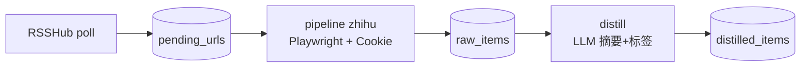

# 知乎流水线（RSSHub → Playwright → LLM）

On1y 的知乎路径与 YouTube 类似：**订阅发现** 与 **正文抓取** 解耦；LLM 蒸馏单独跑。



| 阶段 | 命令 | 做什么 | 耗时 |
|------|------|--------|------|
| **订阅** | `on1y rss poll` | RSSHub 发现新回答/文章 URL 入队 | 秒级 |
| **抓取** | `on1y pipeline zhihu` | Playwright + `data/cookies/zhihu.json` 拉正文 | ~40–70s/条 |
| **蒸馏** | 同上 `--distill N` 或 `on1y distill` | LLM 摘要与标签 | ~5–15s/条 |

## 1. 前置条件

### Cookie（必须）

在 **已登录** 的浏览器导出知乎 Cookie：

```bash
python scripts/import_cookies.py zhihu ~/Downloads/zhihu-cookies.json
on1y cookies status
```

详见 [COOKIES.md](COOKIES.md)。若出现「安全验证」或「进入知乎」，请重导 Cookie 并确认使用系统 Chrome。

### 自建 RSSHub（强烈推荐）

公共 `rsshub.app` 对知乎不稳定且易限流。本地部署：

```bash
# Docker 示例
docker run -d --name rsshub -p 1200:1200 diygod/rsshub
```

在 `.env` 中设置：

```env
ON1Y_ZHIHU_RSSHUB_BASE=http://127.0.0.1:1200
```

## 2. 配置订阅

```bash
cp config/zhihu_follows.txt.example config/zhihu_follows.txt
# 编辑：每行一个关注源（activities / answers / collection / column）

python scripts/sync_zhihu_feeds.py
on1y rss feeds
```

`config/feeds.yaml` 会出现 `zhihu-*` 条目，例如：

```yaml
- url: http://127.0.0.1:1200/zhihu/people/activities/your-id
  label: zhihu-activities-your-id
  enabled: true
```

## 3. 日常命令

```bash
# 发现新内容
on1y rss poll

# 一条龙：抓取 + LLM（默认每次最多抓 3 条，间隔防风控）
on1y pipeline zhihu --ingest 3 --distill 5

# 或分步
on1y pipeline zhihu --ingest 2 --distill 0   # 只抓正文
on1y distill --limit 10                       # 只跑 LLM
```

cron 示例（每 30 分钟 poll，每 10 分钟抓 1 条知乎）：

```cron
*/30 * * * * cd /home/sijin/On1y && ./venv/bin/on1y rss poll >> data/rss.log 2>&1
*/10 * * * * cd /home/sijin/On1y && ./venv/bin/on1y pipeline zhihu --ingest 1 --distill 0 >> data/zhihu.log 2>&1
```

## 4. 风控相关环境变量

```env
# 每条知乎抓取之间的间隔（秒），默认 45
ON1Y_ZHIHU_MIN_INTERVAL_SECONDS=45

# 触发安全验证后建议等待时间（日志提示用），默认 300
ON1Y_ZHIHU_ANTIBOT_PAUSE_SECONDS=300

# Playwright 无头模式；若仍被拦可试 false（需 WSLg / 图形环境）
ON1Y_PLAYWRIGHT_HEADLESS=true
```

触发 **安全验证** 时，worker 会 **停止本批次** 且 **不再自动重试** 该条，避免加重风控。等待数分钟后换 Cookie 或降频再跑。

## 5. 与通用 worker 的区别

| | `on1y worker` | `on1y pipeline zhihu` |
|--|---------------|------------------------|
| 队列 | 所有平台 FIFO | **仅知乎** URL |
| 浏览器 | 每条冷启动 | **同批次复用** 一个浏览器 |
| 间隔 | 无 | 默认 **45s** 间隔 |
| 反爬 | 普通重试 | 检测验证页 → **停批、不重试** |

手动 `on1y ingest https://zhihu.com/...` 仍可用（单条、无间隔），适合偶尔测试。

## 6. 支持的内容类型

RSSHub 入队的链接经 Playwright 提取：

- 回答：`zhihu.com/question/.../answer/...`
- 专栏文章：`zhuanlan.zhihu.com/p/...`

视频（`zvideo`）当前未专门处理，可后续扩展。

## 7. 故障排查

| 现象 | 处理 |
|------|------|
| RSS poll 0 条 | 无新动态；`on1y rss status` 看游标 |
| RSS 解析失败 | 浏览器打开 RSSHub URL 应看到 XML |
| 安全验证 | 重导 Cookie；降 `--ingest`；加大 `MIN_INTERVAL` |
| 正文过短 | Cookie 失效或页面改版，检查 `on1y show --id` |
| LLM 401 | 锯齿云 Base URL / Key，见 Web「LLM 设置」 |

## 8. Web 控制台

`on1y serve` → 点 **知乎抓取** 运行 pipeline；概览里显示 **知乎待入库** 数量。
